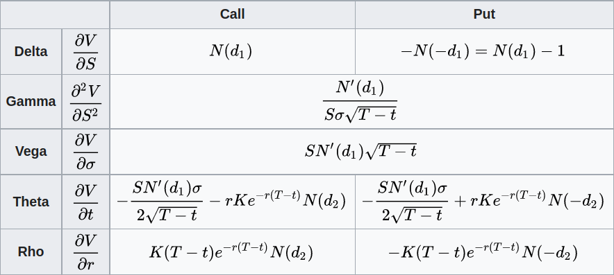

<h1 align="center">Black-Scholes Options Model with Greeks</h1>

## Project Description

This project is a Black-Scholes Options Pricing Calculator for European Options, including graphical visualization of the Option Greeks. It is a web-hosted interactive application, hosted using [Streamlit's](https://streamlit.io) Sharing functionality.

The project can be found here: [Link to Project](https://blackscholeswithgreeks.streamlit.app)

## Black-Scholes Model

The **Black-Scholes model**, also known as the **Black-Scholes-Merton (BSM) model**, is a key concept in modern financial theory. This mathematical equation estimates the theoretical **value of options**, considering the impact of time and other risk factors.

The Black-Scholes equation requires **five variables**:

- **Volatility** of the underlying asset.
- **Price** of the underlying asset.
- **Strike price** of the option.
- **Time until expiration** of the option.
- **Risk-free interest rate**.

## Black-Scholes Model Assumptions

The Black-Scholes model makes several assumptions:

- No dividends are paid out during the life of the option.
- Markets are random (market movements cannot be predicted).
- There are no transaction costs in buying the option.
- The risk-free rate and volatility of the underlying asset are known and constant.
- The returns on the underlying asset are log-normally distributed.
- The option is European and can only be exercised at expiration.

## Call and Put Option Price Formulas

Call option (C) and put option (P) prices are calculated using the following formulas:

The formulas for d1 and d2 are:

## The Option Greeks

"The Greeks" measure the sensitivity of the value of an option to changes in parameter values while holding other parameters fixed. They are partial derivatives of the price concerning the parameter values.

The Greeks include:

- **Delta**: Sensitivity to changes in the price of the underlying asset.
- **Gamma**: Sensitivity to changes in Delta.
- **Theta**: Sensitivity to the passage of time.
- **Vega**: Sensitivity to volatility.
- **Rho**: Sensitivity to the risk-free interest rate.

Their formulas can be seen below:

## 📝 License

© 2024 [Akaash Mitsakakis-Nath](https://github.com/your-github-repo). 
This project is [MIT](https://github.com/your-github-repo/LICENSE.txt) licensed.
